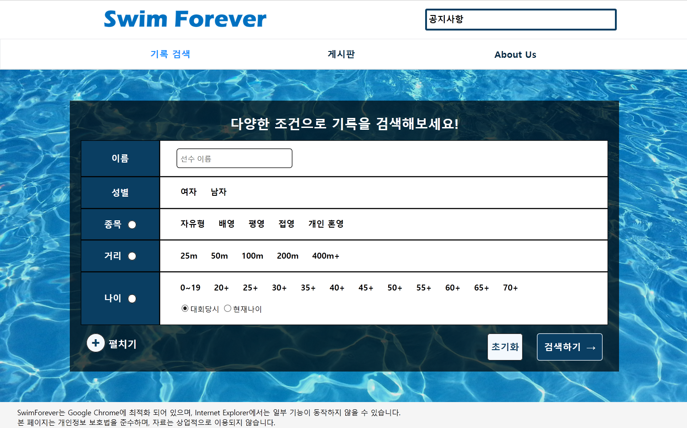
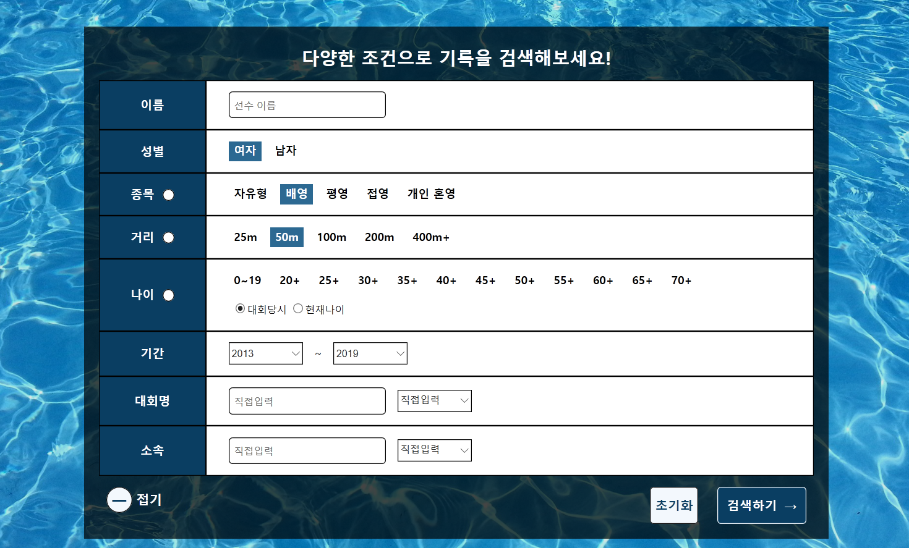
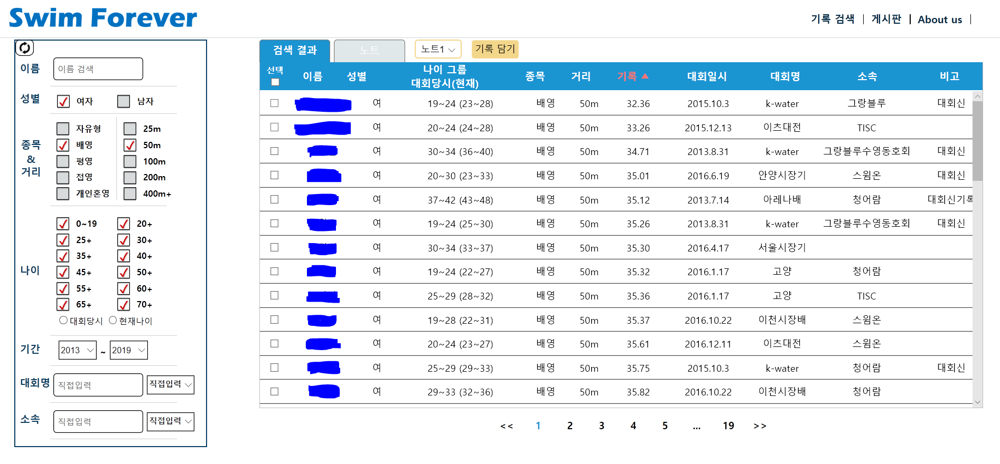
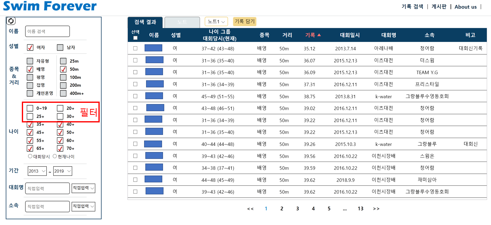
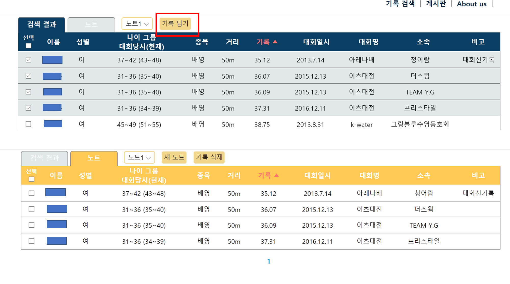
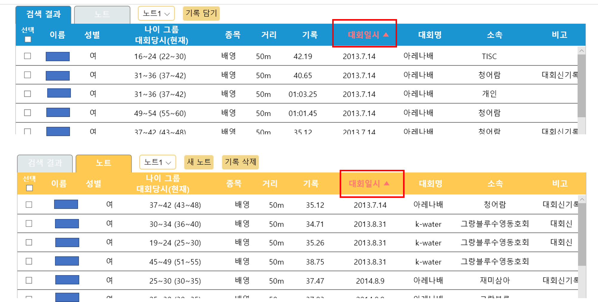

# Project title
The website for searching records on the Korean Masters Championships with HTML, CSS, javaScript, jQuery

## Getting Started
한국 아마추어 수영 선수들을 위한 대회 결과 검색 사이트 제작을 목표로 시작하게 된 프로젝트입니다.

## How to use?
개발 및 테스트가 끝난 후 2019년이 지나기 전에 베타 서비스를 오픈할 예정이다.

## Screenshots
첫 검색 화면. 검색 조건을 입력하고 검색하기 버튼을 누르면 된다. 검색 조건이 너무 많은 항목에 대해서는 전체 선택/해제 기능을 제공하고 있다.

검색 결과 화면. 입력한 검색 조건에 따른 결과를 출력하는 페이지.

검색 결과 내 재검색(이하 필터링) 기능 제공. 필터링을 하게 되면 테이블 색을 변경해서 사용자가 지금 필터링한 결과를 보고 있음을 알려준다.

선수들 간의 기록 비교를 돕기 위해서 검색 결과 내에서 비교하고 싶은 기록들을 선택하여 노트에 담으면 따로 노트 탭에서 해당 기록들만을 보면서 비교할 수 있는 기능을 제공하고 있다. 노트 탭에서는 테이블 색이 노란색으로 변경되고 사용자가 지금 노트를 보고 있음을 명시해준다.

검색 결과 테이블에서나 노트 테이블에서나 정렬 기능을 제공하여 사용자의 편의성을 높였다.

## Tech/framework used
html
css
javaScript
jQuery
php
mysql

## Authors
Jiyun Lee, Seoyoon Baek

<!--
## Code style
## Features
## Code Example
## Installation
## API Reference
## Tests
## How to use?
## Contribute
## Credits
## License-->
