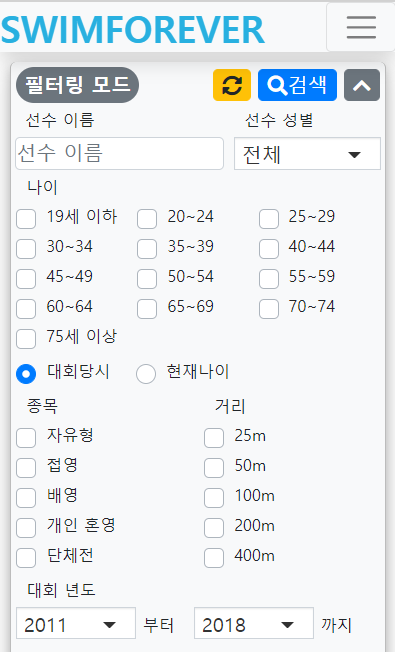

# Project title
The website for searching records on the Korean Masters Championships with HTML, CSS, javaScript, jQuery

## Getting Started
한국 아마추어 수영 선수들을 위한 대회 결과 검색 사이트 제작을 목표로 시작하게 된 프로젝트입니다.

## How to use?
개발 및 테스트가 끝난 후 베타 서비스를 오픈할 예정입니다. 
현재 아래의 url을 클릭하면 검색 결과 기능을 체험해 보실 수 있습니다.  
http://www.swimforever.net/test/test_jy/mvc_ver/html/research.html

## Screenshots
첫 검색 화면. 검색 조건을 입력하고 검색하기 버튼을 누르면 됩니다.
 

  
검색 결과 화면. 입력한 검색 조건에 따른 결과를 출력하는 페이지입니다.
 

  
검색 결과 내 재검색(이하 필터링) 기능을 제공합니다.
 
필터링을 하게 되면 검색 조건 입력 창의 좌측 상단에 "필터링 모드" 라벨을 붙여줌으로써 사용자가 지금 필터링 모드로 사용중인 것을 알려줍니다.
 

  
선수들 간의 기록 비교를 돕기 위해서 검색 결과 내에서 비교하고 싶은 기록들을 선택하여 노트에 담으면 따로 노트 탭에서 해당 기록들만을 보면서 비교할 수 있는 기능을 제공하고 있습니다. 노트 탭에서는 테이블 색이 노란색으로 변경되고 사용자가 지금 노트를 보고 있음을 명시해줍니다.
 

 

  
검색 결과 테이블에서나 노트 테이블에서나 정렬 기능을 제공하여 사용자의 편의성을 높였습니다.
 
(검색 결과 테이블에서는 현재 활성화되어 있는 노트에 이미 담겨있는 기록에 대해서 표시를 해주었습니다. 이를 통해 한 노트에 중복된 기록을 담는 실수가 생기지 않도록 도와주고 있습니다.)
 

 

  
모바일에서의 가독성을 높이기 위해 반응형 웹으로 제작하였습니다.
 

  

## Tech/framework used
HTML
CSS
javaScript
jQuery
PHP
mySQL

## Authors
Jiyun Lee

<!--
## Code style
## Features
## Code Example
## Installation
## API Reference
## Tests
## How to use?
## Contribute
## Credits
## License-->
